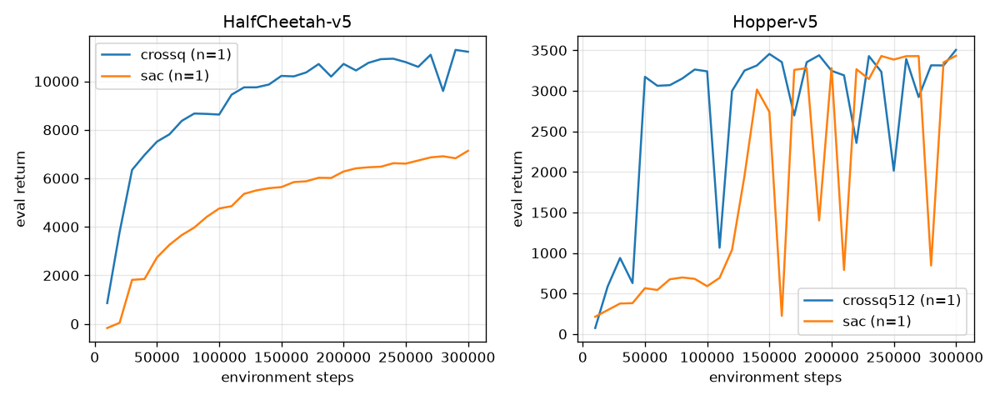

# CrossQ, reproduced in one file

A clean single-file PyTorch implementation of **CrossQ** (Bhatt, Palenicek et al., ICLR 2024,
[arXiv:1902.05605](https://arxiv.org/abs/1902.05605)) with a SAC baseline, plus a survey of where
sample-efficient RL stands in 2026 ([SURVEY.md](SURVEY.md)).

```
crossq.py        the algorithm (380 lines incl. CLI/logging; the CrossQ-specific part is ≈100)
test_crossq.py   4 sanity checks (incl. BatchRenorm equivalence with sb3-contrib's implementation)
plot.py          learning curves from runs/
SURVEY.md        literature survey: ideas, methods, direction of travel
runs/            logs of the experiments reported below
```

## What CrossQ is

SAC with four changes and *nothing else*:

| | SAC | CrossQ |
|---|---|---|
| bootstrap target | Polyak-averaged **target critic** | the **live critic** (no target network) |
| normalisation | none | **BatchRenorm** before every Linear in actor and critic |
| critic forward pass | `Q(s,a)` and `Q_target(s',a')` separately | **one joint pass** on `[(s,a); (s',a')]` so BN statistics come from the 50/50 mixture |
| critic width / Adam β₁ / policy delay | 256 / 0.9 / 1 | **2048 / 0.5 / 3** |
| update-to-data ratio | 1 | 1 |

The joint pass is the whole trick: BatchNorm "does not work in RL" because `(s',a')` is distributed
differently from `(s,a)`, so a target network's running statistics make the next-state batch look
out-of-distribution. Normalising both halves together removes the mismatch, which in turn removes the need for a
target network, which in turn lets the critic learn fast enough that UTD 1 competes with REDQ/DroQ at UTD 20.

## Implementation notes

* Libraries do the generic parts: `gymnasium` (MuJoCo v5 tasks, `RescaleAction`, episode statistics),
  `stable-baselines3` (`ReplayBuffer` with time-limit bootstrapping), `torch`, `tensorboard`.
* `BatchRenorm` is written on top of the fused `F.batch_norm` kernel (a hand-written version was 20× slower on
  Apple MPS). It is numerically checked against `sb3_contrib.common.torch_layers.BatchRenorm1d`.
* Train/eval mode of the BN layers follows the authors' JAX code exactly:
  next actions `a' ~ π(s')` with the actor in eval mode; joint critic pass in train mode; actor update with the
  actor in train mode and the critic in eval mode (so the actor loss does not pollute critic statistics);
  acting in the environment in eval mode.
* Hyper-parameters are the paper's (Table 1 / authors' `train.py`): lr 1e-3, β₁ 0.5, batch 256, critic
  2×2048, actor 2×256, BRN momentum 0.99 (torch convention 0.01), BRN warm-up 100k updates, policy delay 3,
  learning starts 5k, buffer 1M, γ 0.99, auto-tuned entropy with target −|A|.
* `--algo sac` switches to the plain SAC preset; any flag can be overridden for ablations, e.g.
  `--algo crossq --target-networks`, `--no-batch-norm`, `--critic-hidden 256 256`, `--utd 5`.

## Running

```bash
uv sync                                    # torch, gymnasium[mujoco], stable-baselines3, sb3-contrib, ...
uv run test_crossq.py
uv run crossq.py --algo crossq --env Hopper-v5 --seed 0 --steps 1_000_000
uv run crossq.py --algo sac    --env Hopper-v5 --seed 0 --steps 1_000_000
uv run plot.py                             # -> results.png
```

Speed on an Apple M4 (no CUDA): the paper's 2048-wide critic runs at ~7-10 env steps/s on MPS, a 512-wide
critic at ~25-40 steps/s on CPU, SAC at ~80 steps/s. On an RTX 3090 the authors report 1.3 h per 1M Hopper
steps. For a full multi-seed, multi-env reproduction use a GPU box (`--device cuda`).

## Results (Apple M4, single seed, 300k steps, deterministic eval over 5 episodes every 10k steps)



Eval return at matched environment steps (`runs/*/seed0/log.csv`):

| HalfCheetah-v5 | 20k | 50k | 80k | 100k | 150k | 200k | 300k |
|---|---|---|---|---|---|---|---|
| **CrossQ, paper config (2048-wide critic)** | 3793 | 7512 | 8671 | 8628 | 10221 | 10715 | 11217 |
| SAC | 46 | 2740 | 3972 | 4756 | 5638 | 6281 | 7133 |

| Hopper-v5 | 20k | 50k | 80k | 100k | 150k | 200k | 300k |
|---|---|---|---|---|---|---|---|
| **CrossQ, 512-wide critic** | 586 | 3172 | 3152 | 3240 | 3455 | 3246 | 3505 |
| SAC | 296 | 566 | 698 | 591 | 2741 | 3280 | 3433 |

* HalfCheetah: CrossQ passes 7000 at 50k steps; SAC gets there at 300k. CrossQ at 80k (8671) is above SAC's
  best in 300k, reaches 10k by 150k steps and ends at 11217 (SAC: 7133).
* Hopper: CrossQ (even with a 4× narrower critic than the paper) reaches 3000+ at 50k steps; SAC first does at
  140k. Both plateau around 3200-3500 with the usual Hopper eval dips.
* This is the same qualitative picture as Figure 5 of the paper (CrossQ ≈ SAC's return several-fold earlier on
  both tasks), obtained at UTD 1 with one gradient step per environment step. Caveats: one seed per curve, a
  narrower critic on Hopper, and 300k rather than 1-5M steps, all forced by CPU/MPS speed on this laptop.

## Survey

[SURVEY.md](SURVEY.md) covers the lineage MBPO → REDQ → DroQ → resets → CrossQ, then the current threads:
normalisation / no-target-network theory (PQN, SimBa, SimBaV2, CrossQ+WN), replay-ratio scaling and plasticity
(MAD-TD, Forget-and-Grow, Sample Weight Decay), scaling laws (Rybkin et al., compute-optimal scaling), losses
(HL-Gauss, Q-chunking), model-based components (TD-MPC2, MR.Q, DR.Q, EfficientTDMPC, Dream-MPC), real-robot data
priors (RLPD, HIL-SERL, WorldSample) and massively parallel simulation (FastTD3, PQN), ending with the direction
of travel and concrete things to try on top of `crossq.py`.
